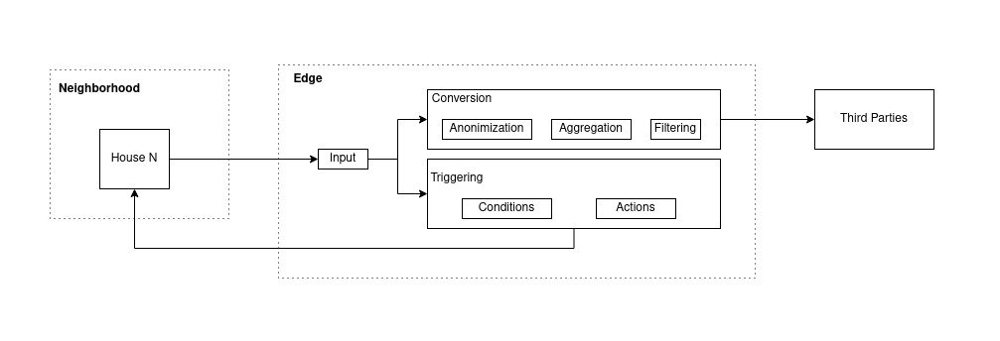

# Edge

A smart meter data protocol using edge computing to enable individual user nudging, customer privacy, improved data quality and reduced network congestion with the aim of moving the energy transition forward.

## Table of Contents

* [Introduction](#introduction)
* [How Does It Work](#how-does-it-work)
* [Triggering](#triggering)
* [Anonymization](#anonymization)
* [Real Time Data Retrieval](#real-time-data-retrieval)


## Introduction
Current smart meter data collection and unlocking for stakeholders is centralized (DSOs are the gatekeeper, single point of failure), closed (access for mandated stakeholders only) and has a 24-hr delay. Real-time and higher-quality data and a transparent and inclusive system is needed to unlock new solutions and business models. This will help in building new technologies to accelerate the energy transition.

The Powerchainger Edge solves the smart meter data infrastructure challenge by offering a solution that enables organizations to trigger actions based on individual households’ behavior. real-time energy monitoring of communities, reducing network traffic and enabling more companies to use the data, all while preserving the privacy of customers. 

The problems are solved by a solution based on edge computing, which means that the computations are done locally on general computing devices placed in the neighborhood by the DSO. The advantage of this is the triggering of customized actions based on real-time data when certain conditions are met, local data conversion and filtering, anonymization techniques before sending data to third parties and network traffic reduction. The following diagram shows the high-level overview of the system.





External parties can define actions to be triggered in the form of controlling connected smart appliances to save energy and promoting sustainable behavior through recommendations. These trigger conditions and actions are defined by the external party, but are uploaded to the edge device, meaning that the company can determine triggers based on certain patterns without actually receiving the data and therefore the user’s data is not shared. 


## How does it work
The Edge protocol will be owned by an organization that facilitates the computing devices in the neighborhood and controls the permissions of external parties, for instance the DSO. The new protocol should allow for more companies to invent new business models on top of smart meter data while preserving the privacy of customers. This is realized through different levels of permissions for different types of organizations. 

The Edge system is used from different angles as follows:
- Household smart meters connect to the API of their local Edge server and post their data readings each t interval.
- Households can give specific consent for specific services and companies. E.g. household A gives consent to Vattenfall for sending recommendations regarding sustainable behavior.
- Organizations can add triggers which include an action based on certain conditions. These triggers are uploaded to the Edge server, meaning the data used for triggering the actions is not shared with the organization, ensuring the privacy of the households.
- Organizations can subscribe to receiving real-time aggregated data of neighborhoods. The data is aggregated to neighborhood level to maintain the privacy of individual users and reduce network traffic.
- Organizations have the ability to retrieve the raw data of the whole neighborhood, but only after certain anonymization techniques have been applied to prevent identifying individual households. The degree of anonymization can be changed based on the permissions of the organization. E.g. the DSO might require more precise data compared to a small service provider.
- Organizations can set their own customized filters in order to choose which kind of data should be received. For example some companies might choose to only receive data when it has been changed to a certain degree in order to reduce network traffic. 

## Triggering
Triggering actions based on patterns in the input data is key into nudging customers to change their behavior. 
This can be done by sending recommendations and controlling smart appliances. Examples include asking users to charge their EV because there is a surplus of power production in the neighborhood or turning off the heater when nobody is home.

External parties can implement custom triggers through customized algorithms 
in a sandboxed environment. The first prototype will support using the Python language for these custom functions.
The implementation is as follows:

### Creating a trigger

POST /triggers/create

Body:
```
    {
        "parameters": [
            "neighborhood_power_consumption",
            "neighborhood_power_production",
        ],
        "function": <Base64 Encoding Custom Function>
        "interval": 36000,
        "action": {
            "type": "notification",
            "content": "There is a surplus of power production in your neighborhood, 
                        now might be a good time to charge your EV!"
        }
    }
```

Custom function uploaded by external party:
```
def condition(neighborhood_power_consumption, neighborhood_power_production):
    if neighborhood_power_production - neighborhood_power_consumption > 500:
        return True
    else:
        return False
```

The parameters and action types are predefined by the protocol. The organization can find the options through the API documentation. 
The idea is that the custom condition developer defines which parameters are required and the protocol determines whether
the organization has the permission to use these specific parameters. If this is the case, the trigger will be accepted
and the function will be ran when data from smart meters is pushed into the network. In order to prevent slowing the performance of the system, the triggers are executed asynchronously and are tested
that they won't run longer than a given timeout. If the function is taking too long, the trigger will not be accepted and the implementer needs to optimize the algorithm. The security of the custom function is provided by running the code in a sandboxed environment, where the output of the function can only ever be a boolean indicating whether the defined action needs to be performed or not.

## Anonymization

Anonymization is provided through
- Providing external parties to define their own custom functions to operate on customer data without the customer data being shared with the external party.
- Aggregating household-level data to neighborhood-level data
- Converting the dataset by applying generalization, suppression and adding noise to the dataset in order to maintain utility but prevent identification of individual households.

Methods used to identify the degree of anonymization are K-Anonimity, L-Diversity, T-Closeness and Differential Privacy.

## Real-Time Data Retrieval
Data can be retrieved by means of subscription or polling. The difference is that the subscription model is a pushing mechanism, meaning that the Edge pushes the data to the external party's http API endpoint. The polling model means that the external party pulls the data by calling the API endpoint of the Edge server.

**Create a subscription:**

POST /data/subscribe
```
{
    "endpoint": "https://energycompany/api/energy-data",
    "interval": 5
}
```

**Pulling the data:**

GET /data

